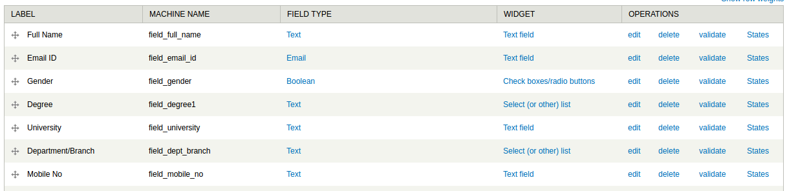
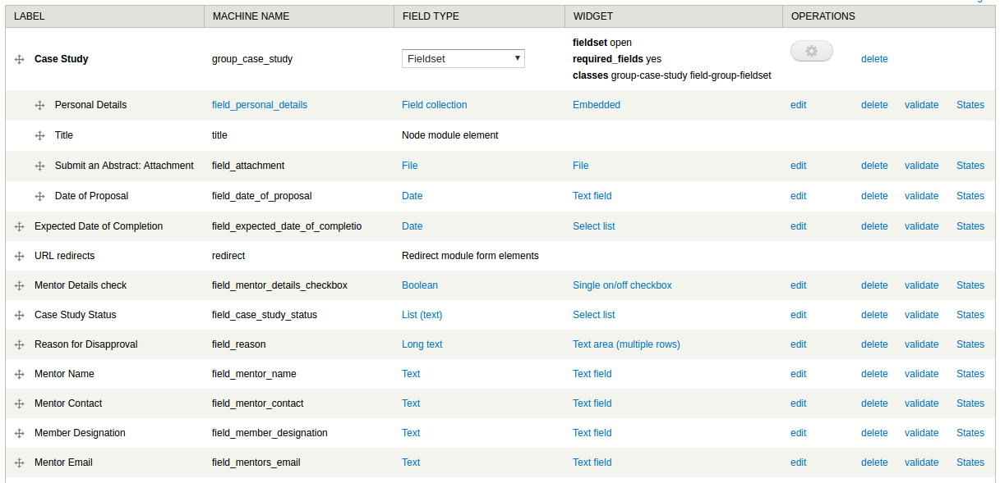
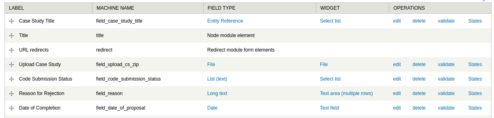
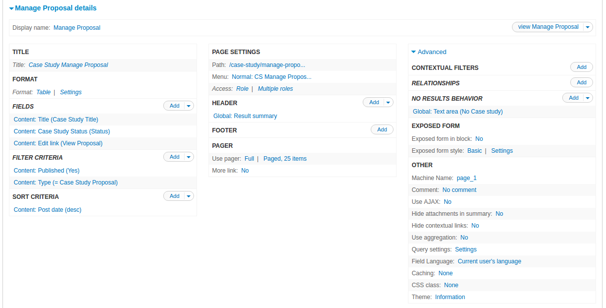
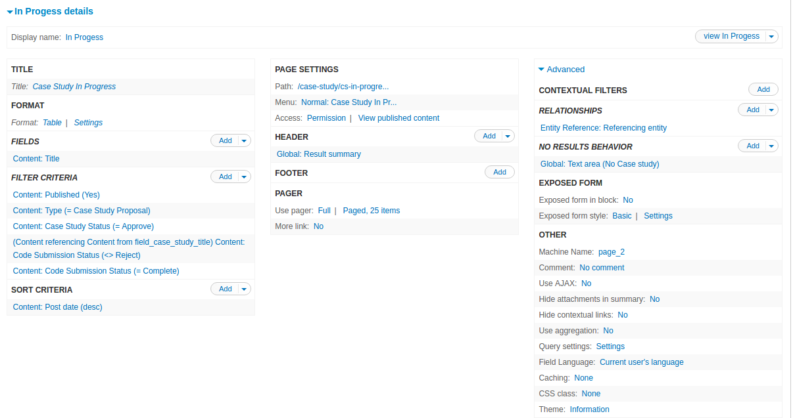
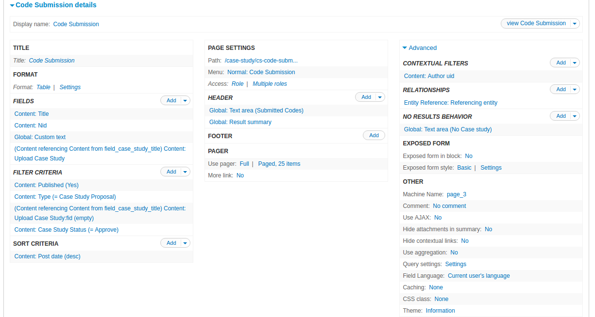
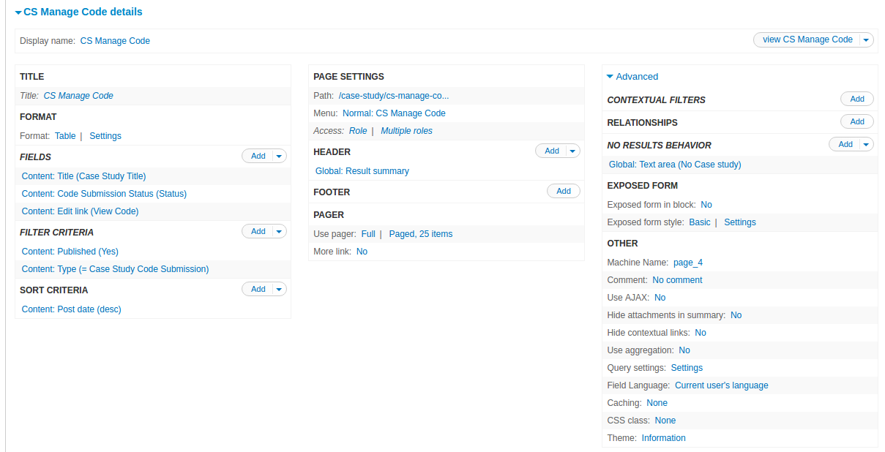
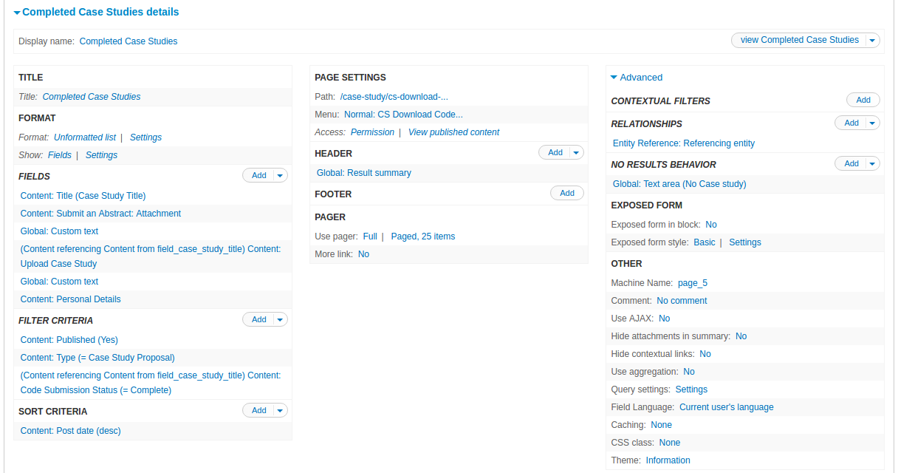
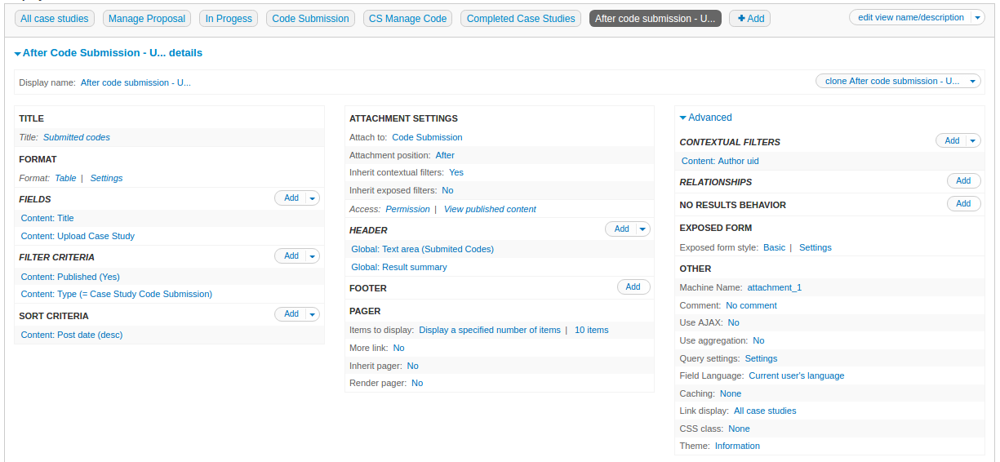

Document Information
====================

Name of the Document: Developer Documentation for Case Study Feature

Date: 11/05/2017

Author: Priyanka Bhagwat

Designation: Software Engineer

Introduction
============

The Case Studies Project aims to promote open source software, such as
OpenFOAM by developing complex case studies using OpenFOAM available to
CFD researchers and users for reference and usage. The participants of
this project can share complex computation problems for this purpose.

Assumptions
===========

It is assumed that the readers of this document are familiar with the
Drupal 7, PHP, MySQL and software engineering. It is also assumed that
the required resources will be available to achieve the objectives of
the plan.

Module Requirements
===================

To achieve this feature the following modules are required

Views

Panels

Entity

Token

Entity\_reference

Rules,

Date,

Link,

Linkicon,

Ctools,

Fieldaccess

Auto\_entitylabel

Disable Field

Field collection

Field Conditional State

SMTP Authentication Support

**Structure-> Field collection-> Field collection field\_personal\_details**

|image111|

**Create-> Content Types -> Case Study Proposal**

**Purpose-** To propose the case study project using the proposal form.

**Modules used (other than core)** -

-  Field Conditional State-When the user selects the checkbox, the
       respective fields are visible.

-  Field Collection- field\_personal\_details field collection is used

-  Date

|image1|

**Create-> Content Types -> Case Study Code Submission**

**Purpose-** To submit the case study codes once the proposal is
accepted.

**Modules used (other than core)** -

-  Date

|image2|

**View**

**Structure -> Views ->Case Study**

1. **Manage Proposal.**

    **Purpose-** This is the admin interface for the reviewer to
    accept/reject the case study proposal.

    **URL-**
    `*http://cfd.fossee.in/case-study/manage-proposal* <http://cfd.fossee.in/case-study/manage-proposal>`__

    **Roles-** Administrator, Case Study Reviewer

    **Query-**

	 SELECT node.title AS node\_title, node.nid AS nid, node.created AS
	 node\_created, 'node' AS
	 field\_data\_field\_case\_study\_status\_node\_entity\_type
	 FROM
	 {node} node
	 WHERE (( (node.status = '1') AND (node.type IN
	 ('case\_study\_proposal')) ))
	 ORDER BY node\_created DESC
	 LIMIT 25 OFFSET 0

    Description

-  The display is in the table format

-  The view is filtered by the criteria - Case study proposal and
       whether the content is published

|image3|

2. **In Progress**

    **Purpose-** This page displays the case studies in progress. The
    Proposals that are approved but not competed.

    **URL-**
    `*http://cfd.fossee.in/case-study/cs-in-progress* <http://cfd.fossee.in/case-study/cs-in-progress>`__

    **Roles-** All

    **Query -**

	 SELECT node.title AS node\_title, node.created AS node\_created
	 FROM
	 {node} node
	 LEFT JOIN {field\_data\_field\_case\_study\_title}
	 field\_data\_field\_case\_study\_title ON node.nid =
	 field\_data\_field\_case\_study\_title.field\_case\_study\_title\_target\_id
	 AND (field\_data\_field\_case\_study\_title.entity\_type = 'node' AND
	 field\_data\_field\_case\_study\_title.deleted = '0')
	 LEFT JOIN {node} field\_case\_study\_title\_node ON
	 field\_data\_field\_case\_study\_title.entity\_id =
	 field\_case\_study\_title\_node.nid
	 INNER JOIN {field\_data\_field\_case\_study\_status}
	 field\_data\_field\_case\_study\_status ON node.nid =
	 field\_data\_field\_case\_study\_status.entity\_id AND
	 (field\_data\_field\_case\_study\_status.entity\_type = 'node' AND
	 field\_data\_field\_case\_study\_status.deleted = '0')
	 LEFT JOIN {field\_data\_field\_code\_submission\_status}
	 field\_case\_study\_title\_node\_\_field\_data\_field\_code\_submission\_status
	 ON field\_case\_study\_title\_node.nid =
	 field\_case\_study\_title\_node\_\_field\_data\_field\_code\_submission\_status.entity\_id
	 AND
	 field\_case\_study\_title\_node\_\_field\_data\_field\_code\_submission\_status.field\_code\_submission\_status\_value
	 = 'Reject'
	 INNER JOIN {field\_data\_field\_code\_submission\_status}
	 field\_data\_field\_code\_submission\_status ON node.nid =
	 field\_data\_field\_code\_submission\_status.entity\_id AND
	 (field\_data\_field\_code\_submission\_status.entity\_type = 'node'
	 AND field\_data\_field\_code\_submission\_status.deleted = '0')
	 WHERE (( (node.status = '1') AND (node.type IN
	 ('case\_study\_proposal')) AND
	 (field\_data\_field\_case\_study\_status.field\_case\_study\_status\_value
	 = 'Approve') AND
	 (field\_case\_study\_title\_node\_\_field\_data\_field\_code\_submission\_status.field\_code\_submission\_status\_value
	 IS NULL ) AND
	 (field\_data\_field\_code\_submission\_status.field\_code\_submission\_status\_value
	 = 'Complete') ))
	 ORDER BY node\_created DESC
	 LIMIT 25 OFFSET 0

    **Description**

-  The display is in the table format

-  The view is filtered by the criteria -

   -  Case study proposal

   -  Content is published

   -  Proposal Status

|image4|

3. **Code Submission**

    **Purpose-** This is the interface where the user can submit the
    codes once the proposal is accepted

    **URL-**
    `*http://cfd.fossee.in/case-study/cs-code-submission* <http://cfd.fossee.in/case-study/cs-code-submission>`__

    **Roles-** All

    **Query-**

	 SELECT node.title AS node\_title, node.nid AS nid,
	 field\_case\_study\_title\_node.nid AS
	 field\_case\_study\_title\_node\_nid, node.created AS node\_created,
	 'node' AS field\_data\_field\_upload\_cs\_zip\_node\_entity\_type
	 FROM
	 {node} node
	 LEFT JOIN {field\_data\_field\_case\_study\_title}
	 field\_data\_field\_case\_study\_title ON node.nid =
	 field\_data\_field\_case\_study\_title.field\_case\_study\_title\_target\_id
	 AND (field\_data\_field\_case\_study\_title.entity\_type = 'node' AND
	 field\_data\_field\_case\_study\_title.deleted = '0')
	 LEFT JOIN {node} field\_case\_study\_title\_node ON
	 field\_data\_field\_case\_study\_title.entity\_id =
	 field\_case\_study\_title\_node.nid
	 LEFT JOIN {field\_data\_field\_upload\_cs\_zip}
	 field\_case\_study\_title\_node\_\_field\_data\_field\_upload\_cs\_zip
	 ON field\_case\_study\_title\_node.nid =
	 field\_case\_study\_title\_node\_\_field\_data\_field\_upload\_cs\_zip.entity\_id
	 AND
	 (field\_case\_study\_title\_node\_\_field\_data\_field\_upload\_cs\_zip.entity\_type
	 = 'node' AND
	 field\_case\_study\_title\_node\_\_field\_data\_field\_upload\_cs\_zip.deleted
	 = '0')
	 INNER JOIN {field\_data\_field\_case\_study\_status}
	 field\_data\_field\_case\_study\_status ON node.nid =
	 field\_data\_field\_case\_study\_status.entity\_id AND
	 (field\_data\_field\_case\_study\_status.entity\_type = 'node' AND
	 field\_data\_field\_case\_study\_status.deleted = '0')
	 WHERE (( (node.uid = '1' ) )AND(( (node.status = '1') AND (node.type
	 IN ('case\_study\_proposal')) AND
	 (field\_case\_study\_title\_node\_\_field\_data\_field\_upload\_cs\_zip.field\_upload\_cs\_zip\_fid
	 IS NULL ) AND
	 (field\_data\_field\_case\_study\_status.field\_case\_study\_status\_value
	 = 'Approve') )))
	 ORDER BY node\_created DESC
	 LIMIT 25 OFFSET 0

   **Description**

-  The display is in the table format

-  The view is filtered by the criteria -

   -  Case study proposal

   -  Content is published

   -  Proposal Status

|image5|

4. **Manage code**

    **Purpose-** This is the admin interface for the reviewer to
    accept/reject the case study codes are submitted.

    **URL-**
    `*http://cfd.fossee.in/case-study/cs-manage-code* <http://cfd.fossee.in/case-study/cs-manage-code>`__

    **Roles-** Administrator, Case Study Reviewer

    **Query-**
	SELECT node.title AS node\_title, node.nid AS nid, node.created AS node\_created, 'node' AS field\_data\_field\_code\_submission\_status  \_node\_entity\_type FROM
	{node}node                                                         
	WHERE (( (node.status = '1') AND (node.type IN 'case\_study\_code\_submission')) 
	ORDER BY node\_created DESC
	LIMIT 25 OFFSET 0  
                                                                                                                     
    **Description**

-  The display is in the table format

-  The view is filtered by the criteria -

   -  Case study proposal

   -  Content is published

   -  Proposal Status

|image6|

5. **Completed Case Studies**

    **Purpose-** This is the admin interface for the reviewer to
    accept/reject the case study codes are submitted.

    **URL-**
    `*http://cfd.fossee.in/case-study/cs-code-submission* <http://cfd.fossee.in/case-study/cs-code-submission>`__

    **Roles-** Administrator, Case Study Reviewer

    **Query**
	SELECT node.title AS node\_title, node.nid AS nid, field\_case\_study\_title\_node.nid AS field\_case\_study\_title\_node\_nid, node.created AS node\_created, 'node' AS field\_data\_field\_attachment\_node\_entity\_type, 'node' AS field\_data\_field\_upload\_cs\_zip\_node\_entity\_type, 'node' AS field\_data\_field\_personal\_details\_node\_entity\_type                                      {node} node                                                                 
	LEFT JOIN {field\_data\_field\_case\_study\_title} field\_data\_field\_case\_study\_title ON node.nid = field\_data\_field\_case\_study\_title.field\_case\_study\_title\_target\_id AND (field\_data\_field\_case\_study\_title.entity\_type = 'node' AND field\_data\_field\_case\_study\_title.deleted = '0')                            
	LEFT JOIN {node} field\_case\_study\_title\_node ON field\_data\_field\_case\_study\_title.entity\_id = field\_case\_study\_title\_node.nid                                                                           INNER JOIN {field\_data\_field\_code\_submission\_status} field\_case\_study\_title\_node\_\_field\_data\_field\_code\_submission\_status ON field\_case\_study\_title\_node.nid = field\_case\_study\_title\_node\_\_field\_data\_field\_code\_submission\_status.entity\_id AND (field\_case\_study\_title\_node\_\_field\_data\_field\_code\_submission\_status.entity\_type = 'node' AND field\_case\_study\_title\_node\_\_field\_data\_field\_code\_submission\_status.deleted = '0')   |
	 WHERE (( (node.status = '1') AND (node.type IN ('case\_study\_proposal')) AND (field\_case\_study\_title\_node\_\_field\_data\_field\_code\_submission\_status.field\_code\_submission\_status\_value = 'Complete') ))  
	 ORDER BY node\_created DESC                                            |
	 LIMIT 25 OFFSET 0 
    **Description**

-  The display is in the table format

-  The view is filtered by the criteria -

   -  Case study proposal

   -  Content is published

   -  Proposal Status

|image7|

6. **Attachment- After code submission**

    **Purpose-** This is the admin interface for the reviewer to
    accept/reject the case study codes are submitted.

    **URL-**
    `*http://cfd.fossee.in/case-study/cs-code-submission* <http://cfd.fossee.in/case-study/cs-code-submission>`__

    **Roles-** Administrator, Case Study Reviewer

    **Query**
	SELECT node.title AS node\_title, node.nid AS nid, node.created AS node\_created, 'node' AS field\_data\_field\_upload\_cs\_zip\_node\_entity\_type    
	FROM                                                                 
	{node} node                                                           
	WHERE (( (node.uid = '1' ) )AND(( (node.status = '1') AND (node.type IN ('case\_study\_code\_submission')) )))                                         
	ORDER BY node\_created DESC                                          
		LIMIT 10 OFFSET 0                                                                                                                            
    Description

-  The display is in the table format

-  The view is filtered by the criteria -

   -  Case study proposal

   -  Content is published

   -  Proposal Status

|image8|

**Configuration -> Workflow -> Rules**

The Rules module allows site administrators to define conditionally
executed actions based on occurring events

On approval CS

