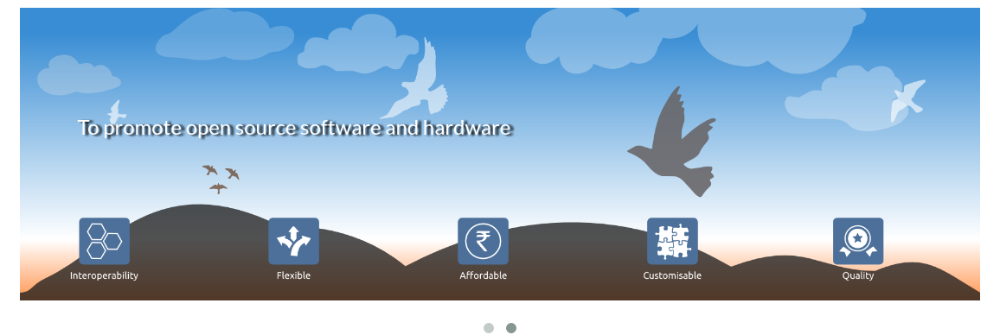

Document Information
====================

Name of the Document: FOSSEE Dynamic Website

Date:23/05/2017

Author: Priyanka Bhagwat

Designation: Software Engineer

Introduction
============

This document focuses on the development of the new FOSSEE Website.

Website
=======

http://fossee.in/

Assumptions
===========

It is assumed that the readers of this document are familiar with the
Drupal 7, PHP, MySQL and software engineering.

Module Requirements
===================

To achieve this feature the following modules are required

Views

Panels

Entity

Token

Radix Layout

Quicktabs

Radix Layout

Owl Carousel

Entity\_reference

Rules

Date

Link

Linkicon

Ctools

Fieldaccess

Auto\_entitylabel

Disable Field

Field collection

Field Conditional State

SMTP Authentication Support

**Website Theme**
-----------------

**Choose an Existing Starterkit**
---------------------------------

-  *CDN Starterkit* <https://drupal-bootstrap.org/api/bootstrap/starterkits%21cdn%21README.md/group/subtheme_cdn/7>

-  *Less Starterkit* <https://drupal-bootstrap.org/api/bootstrap/starterkits%21less%21README.md/group/subtheme_less/7>

-  *Sass Starterkit* <https://drupal-bootstrap.org/api/bootstrap/starterkits%21sass%21README.md/group/subtheme_sass/7>

Here we are using the CDN Starterkit.

**Create a New Sub-theme**
--------------------------

1. Copy over one of the starterkits you have chosen from the
       ./bootstrap/starterkits folder into sites/all/themes or a
       respective sites/\*/themes folder.

2. Rename the folder to a unique machine readable name. This will be
       your sub-theme's "name". For this example and future examples
       we'll use subtheme.

3. Rename ./subtheme/cdn.starterkit or, if using the LESS Starterkit,
       ./subtheme/less.starterkit to match the folder name and append
       .info (e.g. ./subtheme/subtheme.info).

4. Open ./subtheme/subtheme.info and change the name, description and
       any other properties to suite your needs.

    WARNING: Ensure that the .starterkit suffix is not present on your
    sub-theme's .info filename. This suffix is simply a stop gap measure
    to ensure that the bundled starter kit sub-theme cannot be enabled
    or used directly. This helps people unfamiliar with Drupal avoid
    modifying the starter kit sub-theme directly and instead forces them
    to create a new sub-theme to modify.

**Enable Your New Sub-theme**
-----------------------------

In your Drupal site, navigate to admin/appearance and click the Enable
and set default link next to your newly created sub-theme.

**Content Types**
-----------------

**Structure->Content types**

Designation

|image0|

Faculty members

|image1|

FOSSEE Projects

|image2|

FOSSEE Projects contacts

|image3|

Generic links

|image4|

Team Members

|image5|

Resources

|image6|

Article

|image7|

Activities

|image8|

**Views**
---------

**Structure ->Views**

**Faculty members**

**Query**

 SELECT node.nid AS nid, node.created AS node\_created, 'node' AS
  field\_data\_field\_faculty\_name\_node\_entity\_type, 'node' AS
  field\_data\_field\_faculty\_link\_node\_entity\_type
 FROM
 {node} node
 WHERE (( (node.status = '1') AND (node.type IN ('faculty\_members'))  ))
 ORDER BY node\_created ASC

|image9|

**Output**

|image10|

**FOSSEE Projects**

**Query**

  field\_data\_field\_project\_link\_node\_entity\_type, 'node' AS
  SELECT node.nid AS nid, node.created AS node\_created, 'node' AS
  field\_data\_field\_project\_name\_node\_entity\_type, 'node' AS
  field\_data\_field\_project\_logo\_image\_node\_entity\_type, 'node' AS 
  field\_data\_body\_node\_entity\_type
  FROM
  {node} node
  INNER JOIN {field\_data\_field\_project\_status}
  field\_data\_field\_project\_status ON node.nid =
  field\_data\_field\_project\_status.entity\_id AND
  (field\_data\_field\_project\_status.entity\_type = 'node' AND  field\_data\_field\_project\_status.deleted = '0')
  WHERE (( (node.status = '1') AND (node.type IN ('projects')) AND
  (field\_data\_field\_project\_status.field\_project\_status\_value =
  '0') ))
  ORDER BY node\_created DESC

|image11|

**Rewrite results**

|image12|

**Output**

|image13|

**Contact ID**

**Query**

 SELECT node.nid AS nid, node.created AS node\_created, 'node' AS
  field\_data\_field\_project\_contact\_node\_entity\_type, 'node' AS
  field\_data\_field\_contact\_email\_id\_node\_entity\_type
 FROM
 {node} node
 WHERE (( (node.status = '1') AND (node.type IN
 ('fossee\_projects\_contact\_id')) ))
 ORDER BY node\_created ASC

|image14|

**Output**

|image15|

**Generic Content**

**BLOCK - Footer-data Files **

**Query**

 SELECT node.title AS node\_title, node.nid AS nid, node.created AS
 node\_created, 'node' AS
 field\_data\_field\_generic\_image\_link\_node\_entity\_type, 'node'
 AS field\_data\_field\_generic\_image\_node\_entity\_type
 FROM
 {node} node
 INNER JOIN {field\_data\_field\_tags} field\_data\_field\_tags ON
 node.nid = field\_data\_field\_tags.entity\_id AND
 (field\_data\_field\_tags.entity\_type = 'node' AND
 field\_data\_field\_tags.deleted = '0')
 WHERE (( (node.status = '1') AND (node.type IN ('generic\_images'))
 AND (field\_data\_field\_tags.field\_tags\_tid = '5') ))
 ORDER BY node\_created DESC
 LIMIT 5 OFFSET 0

|image16|

**BLOCK- Sponsor Section **

**Query**

 SELECT node.title AS node\_title, node.nid AS nid, node.created AS
 node\_created, 'node' AS
 field\_data\_field\_generic\_image\_link\_node\_entity\_type, 'node'
 AS field\_data\_field\_generic\_image\_node\_entity\_type
 FROM
 {node} node
 INNER JOIN {field\_data\_field\_tags} field\_data\_field\_tags ON
 node.nid = field\_data\_field\_tags.entity\_id AND
 (field\_data\_field\_tags.entity\_type = 'node' AND
 field\_data\_field\_tags.deleted = '0')
 WHERE (( (node.status = '1') AND (node.type IN ('generic\_images'))
 AND (field\_data\_field\_tags.field\_tags\_tid = '6') ))
 ORDER BY node\_created DESC
 LIMIT 5 OFFSET 0

|image17|

**Output**

|image18|

**Resources**

**Query**

 SELECT node.nid AS nid, node.created AS node\_created, 'node' AS
 field\_data\_field\_project\_resources\_node\_entity\_type, 'node' AS
 field\_data\_field\_project\_resocurces\_link\_node\_entity\_type
 FROM
 {node} node
 WHERE (( (node.status = '1') AND (node.type IN ('resources')) ))
 ORDER BY node\_created ASC

|image19|

**Output**

|image20|

**Top Slider**

**Query**

 SELECT node.nid AS nid, node.title AS node\_title, node.created AS
 node\_created, 'node' AS field\_data\_field\_image\_node\_entity\_type
 FROM
 {node} node
 INNER JOIN {taxonomy\_index} taxonomy\_index ON node.nid =
 taxonomy\_index.nid
 WHERE (( (node.status = '1') AND (node.type IN ('article')) AND
 (taxonomy\_index.tid = '4') ))
 ORDER BY node\_created DESC
 LIMIT 5 OFFSET 0

|image21|

**Rewrite results**

|image22|

**Output**

|image23|

**Site Content**

**Query**

**BLOCK -News**

 SELECT node.title AS node\_title, node.nid AS nid, node.created AS
 node\_created, 'node' AS field\_data\_field\_link\_node\_entity\_type
 FROM
 {node} node
 INNER JOIN {field\_data\_field\_tags} field\_data\_field\_tags ON
 node.nid = field\_data\_field\_tags.entity\_id AND
 (field\_data\_field\_tags.entity\_type = 'node' AND
 field\_data\_field\_tags.deleted = '0')
 WHERE (( (node.status = '1') AND (node.type IN ('article')) AND
 (field\_data\_field\_tags.field\_tags\_tid = '2') ))
 ORDER BY node\_created DESC
 LIMIT 5 OFFSET 0

|image24|

**BLOCK- Events**

+--------------------------------------------------------------------------------------------------------------------------------------------------------------------------------------------------------------------+
 SELECT node.title AS node\_title, node.nid AS nid, node.created AS node\_created                                                                                                                                     FROM
 {node} node                                                                                                                                                                                                       
INNER JOIN {field\_data\_field\_tags} field\_data\_field\_tags ON node.nid = field\_data\_field\_tags.entity\_id AND (field\_data\_field\_tags.entity\_type = 'node' AND field\_data\_field\_tags.deleted = '0')   |
 WHERE (( (node.status = '1') AND (node.type IN ('article')) AND (field\_data\_field\_tags.field\_tags\_tid = '3') ))                                                                               
ORDER BY node\_created DESC                                                                                                                                                                                     
LIMIT 5 OFFSET 0                                                                                                                                                                                                   
+====================================================================================================================================================================================================================+
+--------------------------------------------------------------------------------------------------------------------------------------------------------------------------------------------------------------------+

|image25|

**BLOCK- News Page**

 SELECT node.title AS node\_title, node.nid AS nid, node.created AS
 node\_created
 FROM
 {node} node
 WHERE (( (node.status = '1') AND (node.type IN ('article')) ))
 ORDER BY node\_created DESC
 LIMIT 15 OFFSET 0

**Output**

|image26|

Team Members

Query

+-----------------------------------------------------------------------------------------------------------------------------------------------------------------------------------------------------------------------------------------------------------------------------+
 SELECT node.nid AS nid, node.created AS node\_created, 'node' AS field\_data\_field\_team\_members\_name\_node\_entity\_type, 'node' AS field\_data\_field\_member\_designation\_node\_entity\_type, 'node' AS field\_data\_field\_projects\_node\_entity\_type            
FROM                                                                                                                                                                                                                                                                        {node} node                                                                                                                                                                                                                                                                 
 LEFT JOIN {field\_data\_field\_employment\_type\_} field\_data\_field\_employment\_type\_\_value\_0 ON node.nid = field\_data\_field\_employment\_type\_\_value\_0.entity\_id AND field\_data\_field\_employment\_type\_\_value\_0.field\_employment\_type\_\_value = '0'   
 WHERE (( (node.status = '1') AND (node.type IN ('team\_members')) AND( (field\_data\_field\_employment\_type\_\_value\_0.field\_employment\_type\_\_value = '0') )))                                                                                                        
ORDER BY node\_created ASC                                                                                                                                                                                                                                                  
+=============================================================================================================================================================================================================================================================================+
+-----------------------------------------------------------------------------------------------------------------------------------------------------------------------------------------------------------------------------------------------------------------------------+

|image27|

**Output**

|image28|

.. |image1| image:: media/faculty-members.png
   :width: 6.88021in
   :height: 2.00000in

.. |image5| image:: media/team-members.png
   :width: 6.27083in
   :height: 2.51563in

.. |image8| image:: media/activities.png
   :width: 6.27083in
   :height: 1.76563in
.. |image9| image:: media/view-block-faculty-members.png
   :width: 6.73438in
   :height: 3.64583in

.. |image11| image:: media/view-block-fossee-projects.png
   :width: 6.27083in
   :height: 3.58854in
.. |image12| image:: media/block-view-fossee-projects-rewrite.png
   :width: 6.26772in
   :height: 4.48611in
.. |image13| image:: media/projects.png
   :width: 6.26772in
   :height: 5.93056in
.. |image14| image:: media/view-block-contact-id.png
   :width: 6.73438in
   :height: 3.15625in

