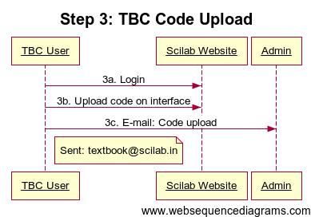
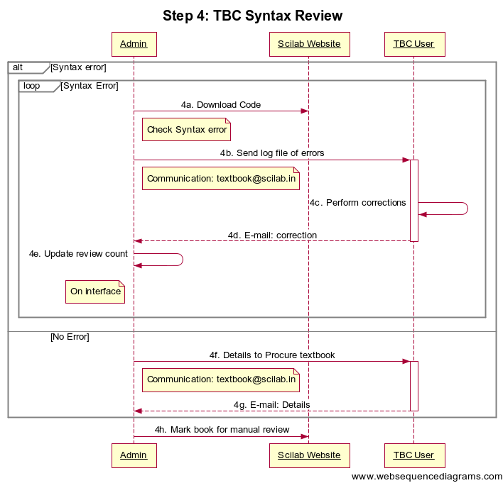
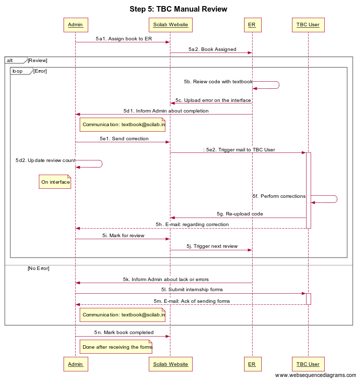
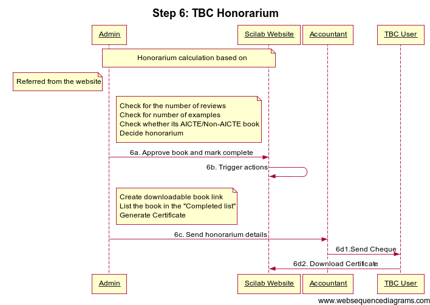
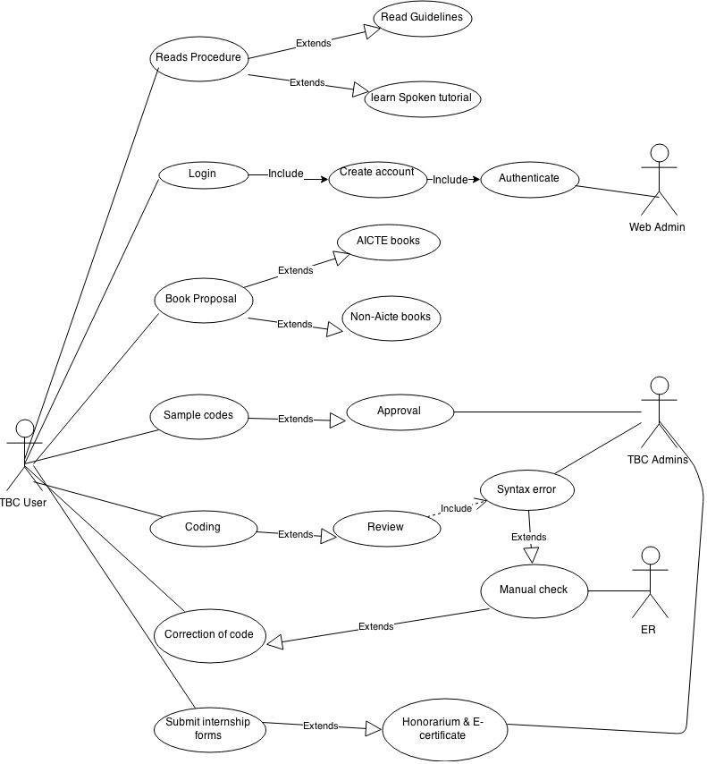
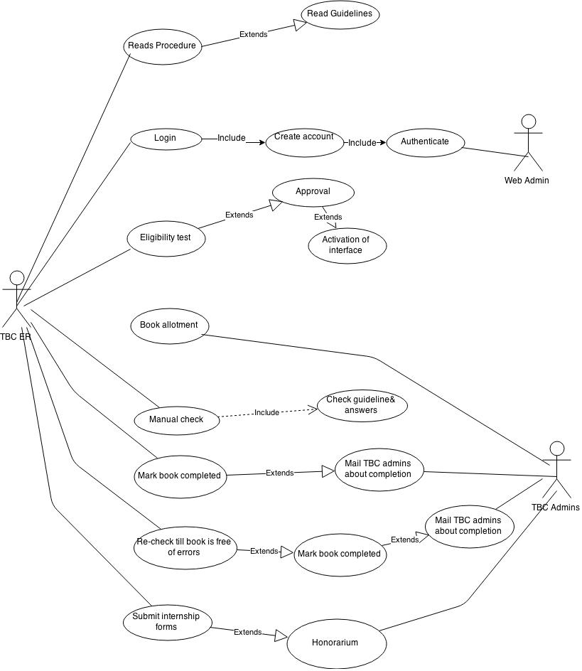
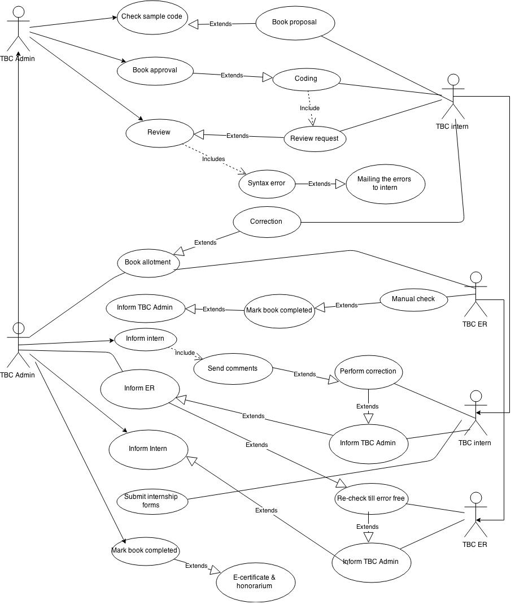
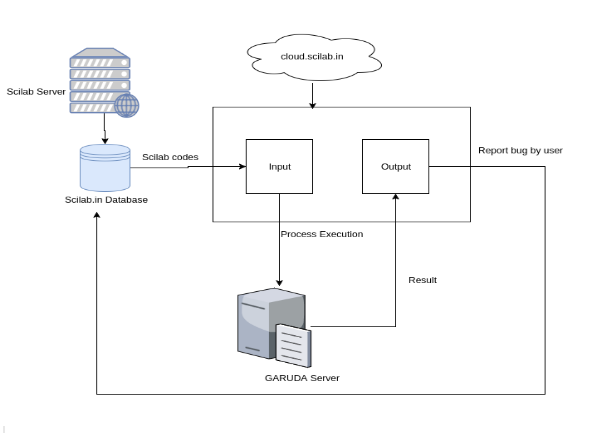
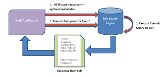

Document Information
====================

Name of the Document: Scilab Process Documentation

Date: 17/05/2017

Author: Priyanka Bhagwat

Designation: Software Engineer

Introduction
============

This document explains the process flow of the activities in Scilab
websites which includes Textbook Companion, Lab migration, Scilab Cloud
etc.

TBC Overview
============

|image0|

|image1|

|image2|

|image3|

|image4|

|image5|

USE Case for TBC

1. User View

|image6|

2. Reviewer View

|image7|

3. Admin View

|image8|

4. Scilab on Cloud
==================

|image9|

5. Apache Solr Search- (TBC Code Search)
========================================

|image10|

**Version 1.0**

Website in: **Drupal 6**

**Problems occurred:**

1. Security Issues.

2. Download Books/codes feature not working.

3. TBC solr search crashed.

4. Manage code approval -> Bulk manage not working

5. Cloud comments cannot reply -> showing database updation failed

6. Few other changes/problems as per given by Lavitha/Bhavani
       <`*link* <https://docs.google.com/document/d/1kFB_ddbKU_hC5lZIhWfMrG4lUD7DOaFJtjF4cVcF4-U/edit>`__>

7. Scilinks data not fetching

8. Reviewer interface crashed.

9. Code Dependency

**Version 2.0**

Website Migrated to **Drupal 7** : 7/9/2015

**Issues Fixed:**

1. Security Issues - Regular security updates are taken, Added Captcha,
       RECaptcha

2. Download Books/codes feature fixed - Used Drupal Ajax API ; mim
       maintenance fixes as per requirement

3. TBC solr search fixed - Used latest supported Solr search engine.

4. TBC and Lab migration Interface fixed- Tested by Shamika, Bhavani,
       Lavitha.

5. Few other changes/problems as per given by Lavitha/Bhavani
       <`*link* <https://docs.google.com/document/d/1kFB_ddbKU_hC5lZIhWfMrG4lUD7DOaFJtjF4cVcF4-U/edit>`__>:
       Fixed

6. Scilinks data not fetching (As per discussion with Kannan Sir,
       Sanmugam in meeting, it cannot be fixed for Drupal 7)

7. Code Dependency ( In Progress)

8. Regular maintenance as per issues/errors/requirement.

**New Features Added:**

1. Book Completion- Earlier the interface was not saving actual
       completion of Book. This feature was added.

2. TBC Edit Caption - Permitted User can edit caption, Email
       notification to concerned person for every edit is been sent.

3. TBC Edit Code - Permitted User can edit actual codes submitted by
       user.

4. Proposal Form Updation - Changed Proposal form as per discussion in
       reference to Statistics i.e State, City, Pincode etc

5. Certificate Generation and Internship forms - Implemented dynamic
       Certificate Generation and Internship forms.

6. Other implementations as per this doc
       <`*link* <https://docs.google.com/document/d/12wJOl_ahPZwqPzQn_mxTLsgNKHvL-RCEKh1HOx-B-lA/edit>`__>

.. |image0| image:: media/Step1_TBCAccount creation.png
   :width: 5.69792in
   :height: 4.41667in
.. |image1| image:: media/Step2_TBCBook Proposal.png
   :width: 6.26772in
   :height: 9.69444in

